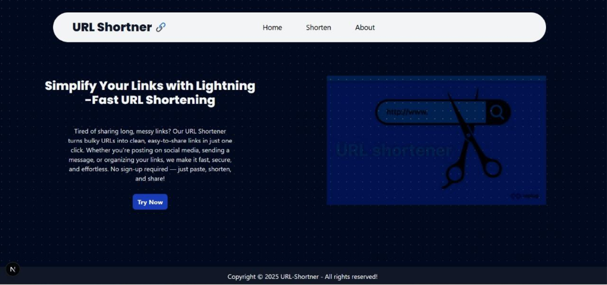
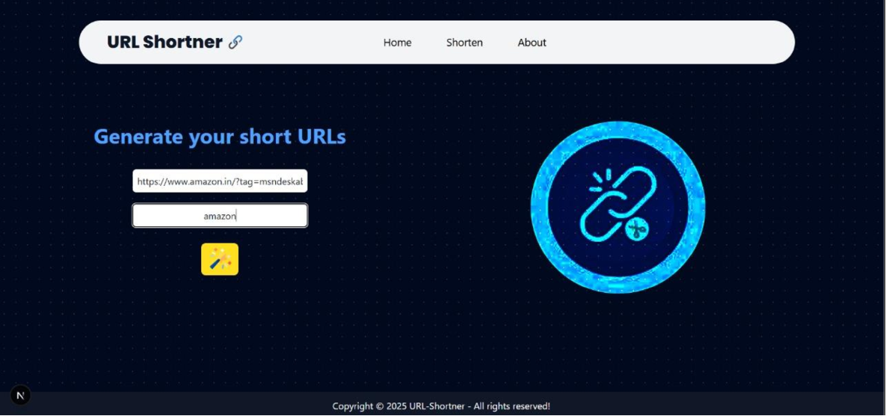
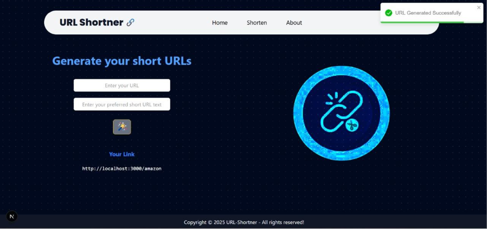

# 🔗 URL Shortener

A modern full-stack URL shortening application built with **Next.js**, **MongoDB**, and **Tailwind CSS** that allows users to convert long URLs into short, easy-to-share links with custom aliases.

---

## 🚀 Features

* 🔗 Shorten long URLs instantly
* ✏️ Create custom short aliases
* ⚡ Fast redirection to original URLs
* 📱 Responsive design for all devices
* 🗄️ MongoDB database integration
* ✅ Input validation and error handling
* 🎨 Clean and user-friendly interface

---

## 🛠️ Tech Stack

### Frontend

* Next.js
* React
* Tailwind CSS

### Backend

* Next.js API Routes

### Database

* MongoDB

### Tools

* Git
* GitHub
* VS Code

---

## 📸 Screenshots

### 🏠 Home Page



### ✨ Create Short URL



### 🔗 Generated Short URL



---

## ⚙️ Installation

### Clone the Repository

```bash
git clone https://github.com/MimansaPatle/URL-Shortener.git
```

### Navigate to Project Directory

```bash
cd URL-Shortener
```

### Install Dependencies

```bash
npm install
```

### Configure Environment Variables

Create a `.env.local` file:

```env
MONGODB_URI=your_mongodb_connection_string
```

### Run the Application

```bash
npm run dev
```

Open:

```text
http://localhost:3000
```

---

## 📂 Project Structure

```text
URL-Shortener/
│
├── screenshots/
│   ├── home-page.png
│   ├── create-url.png
│   └── generated-short-url.png
│
├── app/
├── components/
├── public/
├── lib/
├── models/
├── pages/
├── README.md
└── package.json
```

---

## 🎯 Use Cases

* Sharing long URLs efficiently
* Creating memorable custom links
* Managing links for projects and portfolios
* Improving user experience with shorter URLs

---

## 🔮 Future Improvements

* User Authentication
* Analytics Dashboard
* Click Tracking
* QR Code Generation
* Link Expiration Support
* User Dashboard
* Custom Domains

---

## 👨‍💻 Author

**Mimansa Patle**

* GitHub: https://github.com/MimansaPatle
* LinkedIn: https://www.linkedin.com/in/mimansa-patle-b489a6309

---

## ⭐ Support

If you found this project useful, consider giving it a ⭐ on GitHub.

